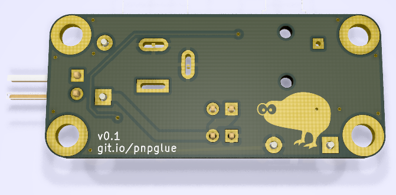

# Hand Pick n Place glue board
This is just a small board I use to connect all the parts for my hand-vacuum pick and place tool. It connects a 12v vacuum pump, a 12v solenoid, a foot-switch, power-switch and power supply in a neat way.

